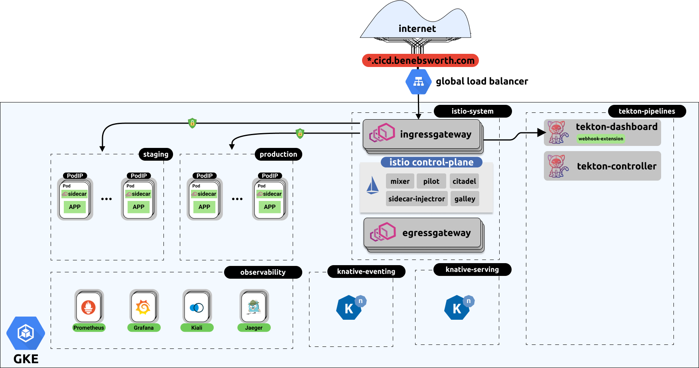
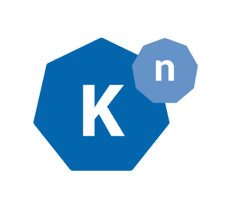
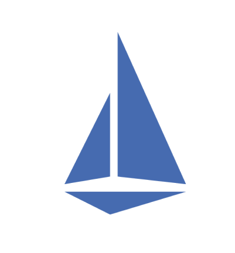
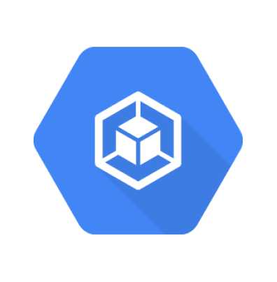
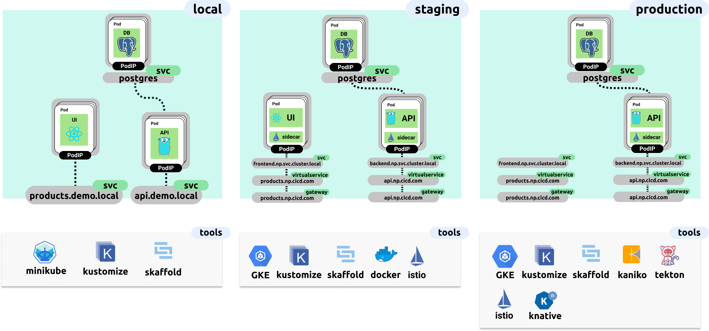
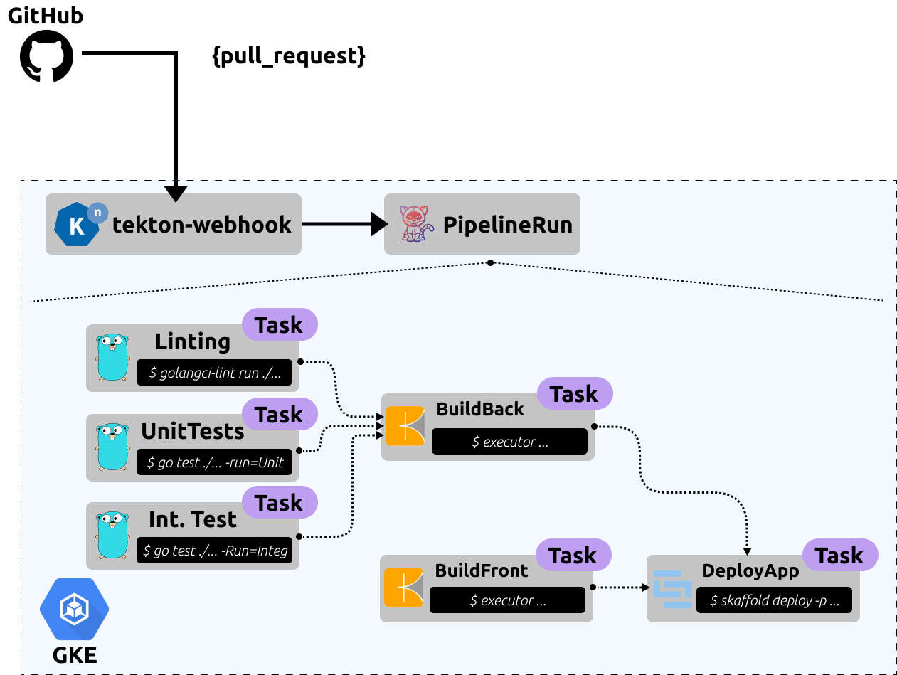

# Kubernetes-Centric CI/CD

This repository captures the talk and demonstration carried presented at x,y,z. The aim is to cover the current Kubernetes ecosystem, which enables an entirely Kubernetes based CI and CD solution to be implemented. We also discuss the benefits of this and why you should care.

## Contents

[Installation](./docs/install.md)

## Architecture

## Technologies

In this talk and demonstration we utilise the following technologies

### Tekton

The Tekton Pipelines project provides Kubernetes-style resources for declaring CI/CD-style pipelines. Superseding Knative build, tekton provides more sophisticated capability and a focused community project independent of Knative. 

&nbsp;

### Knative

Knative components build on top of Kubernetes, abstracting away the complex details and enabling developers to focus on what matters. Built by codifying the best practices shared by successful real-world implementations, Knative solves the "boring but difficult" parts of building, deploying, and managing cloud native services so you don't have to.

&nbsp;

### Kustomize

For the management of Kubernetes resources, kustomize provides a template-free mechanism for bundling and mutating resources based off environment and other contexts. Effectively providing a similar capability to templating tooling such as Helm, with less cognitive complexity or abstracted templating.

&nbsp;

### Kaniko

 

Kaniko enables the build of OCI compliant containers without using the Docker daemon. The Kaniko executor also runs in user-space, avoiding privileged escalation, normally required for a Docker daemon based build. As Kaniko is just a binary tool, we can run it within a Kubernetes cluster with ease.

### Istio

 

Istio is a control-plane orcestration framework for Envoy, this forms what is commonly referred to as a "Service Mesh". Providing a mechanism for transparently enabled mTLS, service resiliency, observability, and enhanced authn/authz controls on a per-microservice basis.

### GKE

 

GKE (Google Kubernetes Engine) provides our Kubernetes cluster for remote development and testing, as well as production deployments. One of the cool things demonstrated in this repository in a nice feature of effectively "pausing" and "resuming" your cluster, where during the paused state, you don't pay for the compute nodes!
## Environments

## Pipelines

## Future Work

Over time it would be great to extend the range of pipelines available to include other tooling to enable a robust feature comparison and understanding when evaludating trace-offs and technology choice best-fit for the given environment. Some extra features to add would be:

* ArgoCD based CI/CD pipelines, including canary releases and rollbacks
* More pathways for demonstrating the istio capabilities around observability, service resiliency and security
* More sophisticated full-stack applications including but not limited to:
  * message queue integration (kafka, NATS)
  * redis, mongoDB and other storage solutions
  * additional protocols such as gRPC, Thrift et al.
  * Add additional workflows as the feature sets are extended for Tekton, these include:
    * pipeline conditionals
    * extended git-triggering
    * utilise comments for git-ops workflows